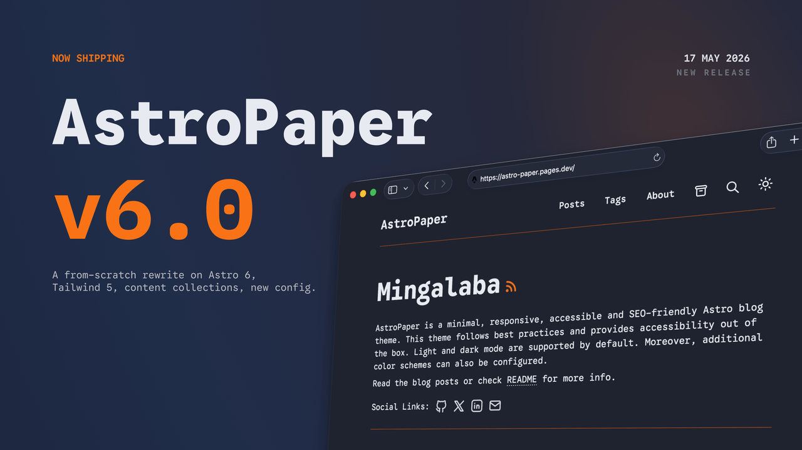

AstroPaper+ v7.0 is the first release of the **AstroPaper+** line. It is a fork of AstroPaper (originally named "AstroPaper", by [Sat Naing](https://github.com/satnaing)) published at [msoltanov/astro-paper-plus](https://github.com/msoltanov/astro-paper-plus). The release layers on top of upstream AstroPaper v6.1.0: the **AstroPaper+** branding, multi-language content support across supported locales (en / ru / tr), a new `galleries` content collection with PhotoSwipe v5 lightbox, video / audio embeds via a shared provider registry, a markdown body pipeline rebuilt around build-time rehype plugins (lazy-image hints, figure captions, external-link hardening, heading-anchor permalinks, slug-based heading IDs), an opt-in sticky right-rail table of contents, a custom sitemap integration that emits `<lastmod>` and `<xhtml:link rel="alternate">` hreflang annotations, CLDR-aware pluralization, centralised date formatting, auto-extracted post descriptions from `<!-- more -->` markers, responsive tables, a unified back-to-top control, a `pnpm gate` local mirror of the CI pre-publish audit, and the project's `.harness/` agent-team scaffolding (no end-user impact). All additive — opt-in features (`features.enableGalleries`, `tocAside: true`) default off; no breaking changes to user-facing configuration or content-collection schemas.

## Table of contents

## Headlines

- **Renamed to AstroPaper+ v7.** Every user-visible string reads `AstroPaper+ v7`; internal TypeScript identifiers (`AstroPaperConfig`, `defineAstroPaperConfig`, …) are kept so existing config files keep working.
- **Multi-language content (en / ru / tr)** shipped out of the box — see "i18n" below.
- **New content collections** alongside posts and projects: `galleries` (PhotoSwipe v5 lightbox, opt-in via `features.enableGalleries`) and video / audio embeds (shared provider registry, YouTube / Vimeo / Loom / Bilibili / Twitch / SoundCloud / Spotify).
- **Markdown body pipeline rebuilt** with five build-time rehype plugins — `rehype-slug` for stable heading IDs, `rehypeLazyImages` for LCP-correct loading hints, `rehypeFigureCaption` for title → figcaption, `rehypeExternalLinks` for `target="_blank"` + `rel="noopener noreferrer"`, and `rehypeHeadingAnchors` for build-time `#` permalinks.
- **Sticky right-rail table of contents** (opt-in via frontmatter `tocAside: true`) with `IntersectionObserver` scrollspy, View-Transitions-compatible.
- **Custom sitemap integration** (`src/integrations/sitemap.ts`) replaces `@astrojs/sitemap` — emits per-URL `<lastmod>`, splits posts into their own `sitemap-posts-0.xml` chunk, and emits `<xhtml:link rel="alternate">` hreflang across the supported locales.
- **CLDR-aware pluralization + centralised date formatting** — new `plural(locale, count, forms)` and `formatDate(date, locale, opts)` helpers in `src/i18n/format.ts`, driven by a configurable `site.dateFormat` in `astro-paper.config.ts`.
- **Auto-extracted post descriptions from `<!-- more -->` markers** — falls back when frontmatter `description:` is missing (fence-aware, markdown stripped).
- **`pnpm gate`** — local mirror of the CI pre-publish audit (`pnpm test` + `pnpm lint` + `pnpm format:check` + `pnpm build`) with one audit log.
- **Upstream attribution preserved** — README, About, CONTRIBUTING, issue templates and every release post credit and link back to the upstream project at `satnaing/astro-paper`.

## Fork rebrand

- Site title, OG card, README header and badges, About pages (×3 locales), project cards (×3 locales), CONTRIBUTING, issue templates, VS Code snippets, code comments, and the CHANGELOG all use the **AstroPaper+ v7** name.
- The npm package name is `astro-paper-plus` and `package.json#version` is `7.0.0`.
- `astro-paper.config.ts` carries an explicit `(AstroPaper+ v7)` tag in the site description so search snippets are unambiguous.

## i18n

- Locale-scoped `src/content/posts/<locale>/` folders and parallel `src/pages/[locale]/` routes for en, ru, tr.
- All UI strings live in `src/i18n/lang/<locale>.ts` under a typed `UIStrings` contract; the `tplStr` helper handles parameterized strings so translators can reorder tokens freely.
- A header `Language` switcher follows the user across pages and persists the chosen locale in the URL.
- Per-locale RSS feeds are generated at `/<locale>/rss.xml`.
- Russian (`ru`) is fully supported alongside `en` / `tr`, mirroring every per-locale content directory (`src/content/posts/ru/`, `src/content/projects/ru/`, `src/content/pages/ru/`, `src/content/galleries/ru/`) and shipping the full CLDR plural set (`one` / `few` / `many` / `other`) for Russian-only CLDR ranges that the other locales collapse into `one` + `other`.

## Content collections

- **`galleries`** — opt-in via `features.enableGalleries` in `astro-paper.config.ts`. Per-gallery MDX files under `src/content/galleries/<locale>/<slug>.mdx` with frontmatter `title` / `description` / `pubDatetime` / `coverImage` / `images: [{ src, alt, caption? }]`. PhotoSwipe v5 lightbox; CSS bundled into the detail page only; JS dynamically imported on first open so the rest of the site pays zero bytes. Responsive 2 / 3 / 4-column thumbnail grid; re-initialises after `astro:after-swap` for view-transition compatibility.
- **Video / audio embeds** — new `remarkEmbeds` plugin plus `<VideoEmbed>` / `<AudioEmbed>` MDX components. Authors can paste a bare URL on its own line, use link-with-caption syntax, or use native `<video controls preload="metadata">` for self-hosted MP4. Providers: YouTube (privacy-respecting `youtube-nocookie.com` by default), Vimeo, Loom, Bilibili, Twitch, SoundCloud, Spotify. One provider registry shared between markdown and MDX paths.

## Markdown body pipeline

- **`rehype-slug@6.0.0`** — every heading in `.md` / `.mdx` posts gets a stable `id` derived from its text content (was missing — the runtime `#`-injector was producing empty `id=""`).
- **`rehypeLazyImages`** — first `` of every post keeps `loading="eager"` + `fetchpriority="high"` (LCP escape hatch); every other `` gets `loading="lazy"` + `decoding="async"`. Author escape hatches: `data-no-lazy`, `no-lazy` class, explicit `loading=…`, `data-lcp`.
- **`rehypeFigureCaption`** — `` turns the `title` into a real `<figcaption>` inside a wrapping `<figure>` (the `title` attribute is stripped from the `` so the same text doesn't double-render as caption + hover tooltip). Tied to `title` rather than `alt` by design — alt text and captions serve different audiences (screen readers vs sighted readers), and coupling them forces authors to write a11y-bad alt text or deliberately-empty alt to escape the plugin. Author escape hatches: `data-no-caption`, `no-caption` class, hand-rolled `<figure>`, image inside `<a>`.
- **`rehypeExternalLinks`** — off-site absolute URLs get `target="_blank"` + `rel="noopener noreferrer"` + a visually-hidden ` (opens in new tab)` for screen readers (WCAG 2.1 SC 3.2.5). Internal / root-relative / fragment / `mailto:` / `tel:` / `javascript:` / `data:` URLs are skipped.
- **`rehypeHeadingAnchors`** — every h2..h6 ships with a build-time `#` permalink child; replaces the previous runtime DOM-injection script (which had FOUC, silently missed the per-locale `/<locale>/posts/<slug>` pages, and didn't work without JS). Author escape hatches: `data-no-heading-anchors`, `no-heading-anchors` class, nested-in-`<a>` / `<button>`, idempotency.

## Navigation & reading UX

- **Sticky right-rail table of contents** — opt-in via frontmatter `tocAside: true`. `<TableOfContents>` renders twice from one source: a collapsible `
` at the top of the article below `lg` and a sticky right-rail `aside` (`hidden lg:block`, `position: sticky; top: 5rem;`) at `lg+`. Scrollspy via `IntersectionObserver` with `rootMargin: "0px 0px -75% 0px"`. Short-circuits to "no render" for posts with fewer than 2 h2/h3 entries.
- **Responsive tables** — new `<ResponsiveTable>` Astro component wraps slot content in a horizontally scrollable container with `min-w-xl` floor + edge fade gradients that toggle via inline-script-managed `data-at-start` / `data-at-end` attributes. `variant` prop: `minimal` / `striped` / `striped-minimal`.
- **Back-to-top button refactor** — unified frosted-pill style on both desktop and mobile (was two different visual identities — 56×56 circular FAB on mobile, subtle pill on desktop).

## SEO & feeds

- **Custom sitemap integration** (`src/integrations/sitemap.ts`) replaces `@astrojs/sitemap`. Per-URL `<lastmod>` from frontmatter `modDatetime` (falling back to `pubDatetime`), resolved through `parseDateInTz` so ambiguous strings honour the post's `timezone` field. Posts split into their own `sitemap-posts-0.xml` chunk; `<xhtml:link rel="alternate">` hreflang emitted for every multi-locale slug. Pure helpers split into `src/utils/sitemap.ts` for unit-testability.
- **RSS feeds** (default + per-locale `src/pages/[locale]/rss.xml.ts`) carry the post description (frontmatter `description:` or body excerpt up to `<!-- more -->`), falling back to `config.site.description` when neither is present.

## i18n & formatting

- **`formatDate(date, locale, opts)`** helper wraps `Intl.DateTimeFormat` with graceful fallbacks (unknown locale → English; invalid options → `Date#toString()`). Configurable `site.dateFormat.{post,project}` in `astro-paper.config.ts`. `dayjs` is no longer imported by any `.astro` component — retained only in `src/utils/parseDateInTz.ts` for timezone _parsing_.
- **`plural(locale, count, forms)`** helper built on `Intl.PluralRules`. `UIStrings.gallery.photoCount` is a typed `PluralForms` object; Russian ships `one` / `few` / `many` / `other`, English and Turkish ship `one` + `other`.

## Operations

- **`pnpm gate`** — new `scripts/gate.mjs` runner executes `pnpm test` + `pnpm lint` + `pnpm format:check` + `pnpm build` sequentially with fail-fast semantics, writes one audit log to the OS temp dir (POSIX: `$TMPDIR/astro-paper-gate.log`; Windows: `%TEMP%\astro-paper-gate.log`; override via `ASTRO_PAPER_GATE_LOG`). Mirrors `.github/workflows/ci.yml`.
- **25 test files** covering the new feature surface — remark/rehype plugins, sitemap helpers, gallery locale routing, TOC tree builder, post-description extraction, external-link rules, heading-anchor idempotency.

## Content translation

- **Translator footer on every upstream-derived post** — attribution blockquote crediting [Sat Naing](https://github.com/satnaing) as the original author and [Mekan Soltanov](https://github.com/msoltanov) as the translator for the fork.
- **Third-person voice across Sat-attributed content** — every upstream-translated post rewritten from Sat's first-person voice to third-person, with an italic translator note at the top of the two demo posts.

## Acknowledgements

AstroPaper+ v7.0 is built on top of the brilliant work in upstream AstroPaper v6.1.0 by [Sat Naing](https://github.com/satnaing) and the upstream contributors. Please consider starring the upstream project and [supporting Sat on GitHub Sponsors](https://github.com/sponsors/satnaing).

See also:

- [How to configure AstroPaper+ theme](/posts/how-to-configure-astropaper-theme/)
- [Adding new posts in AstroPaper+](/posts/adding-new-posts-in-astropaper-theme/)
- [How to add galleries to your blog](/posts/how-to-add-galleries/)
- [How to add video and audio in blog posts](/posts/how-to-add-video-and-audio-in-blog-posts/)
- [How to add a sticky right-rail table of contents](/posts/how-to-add-toc/)
- [Upstream AstroPaper v6.0 release notes (basis of this fork)](/posts/astro-paper-v6/)
