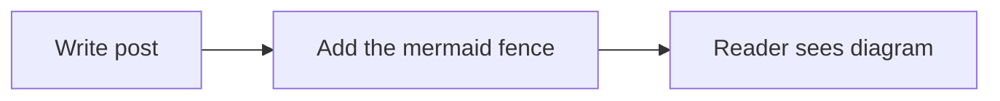
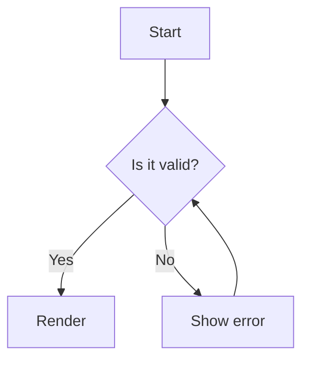
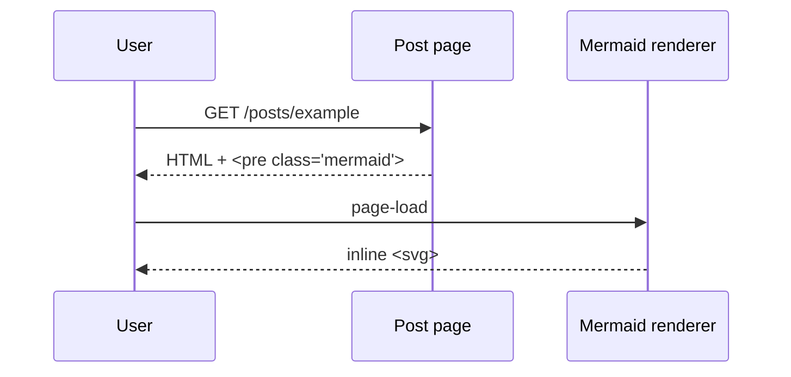
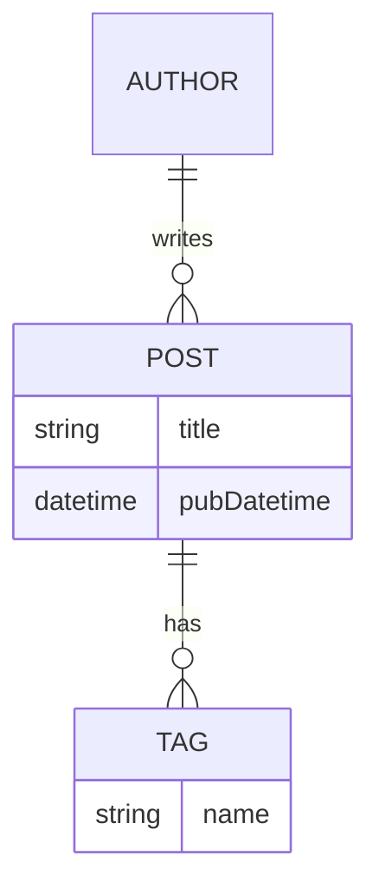
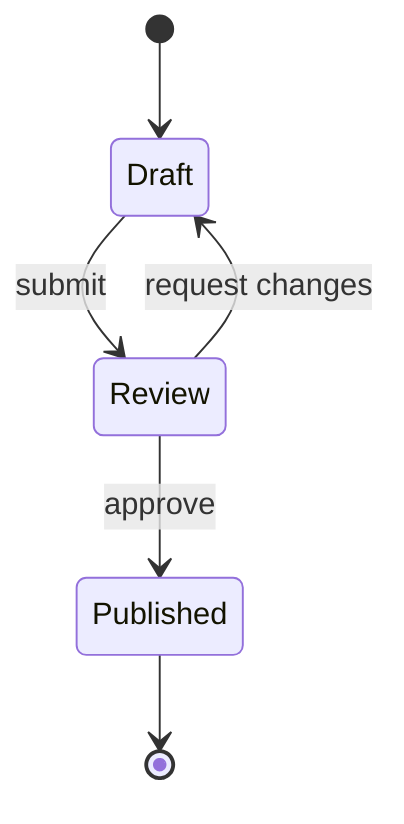
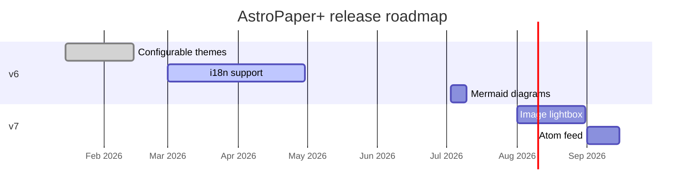
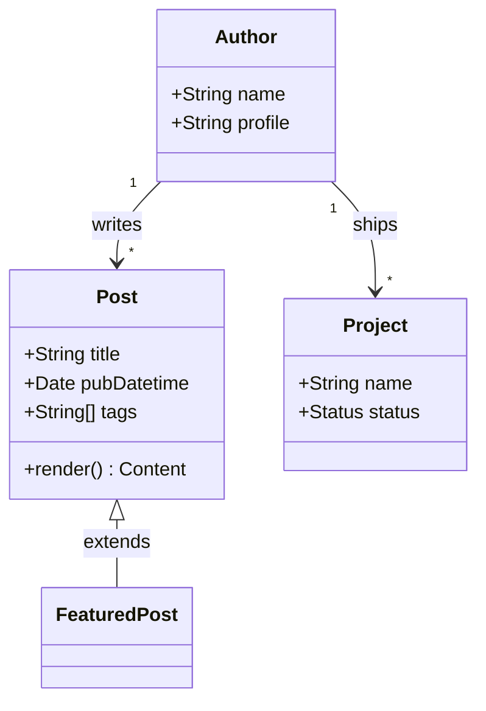
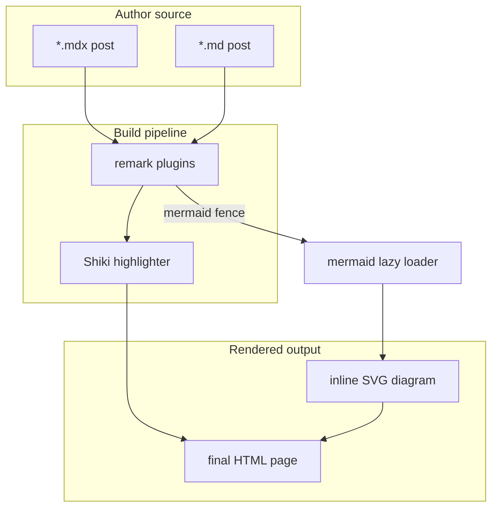
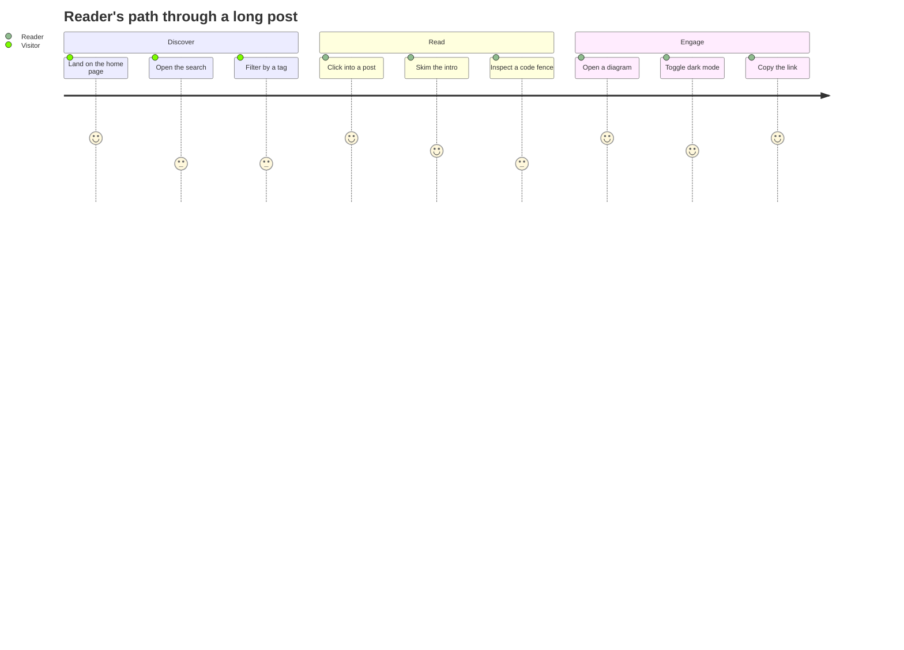
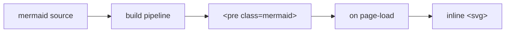

This post shows how to render [Mermaid](https://mermaid.js.org/) diagrams inside AstroPaper+ posts — both `.md` and `.mdx`. Mermaid is a JavaScript diagramming tool that turns text into SVG: flowcharts, sequence diagrams, ER diagrams, Gantt charts, etc.

## Table of contents

## Quick example

A diagram is just a fenced code block with the language set to `mermaid`:

````markdown

````

Which renders as:


## Why this approach

Most "Mermaid in Astro" recipes rely on either SSR rendering through a headless browser (fragile in CI/Docker) or wrapping diagrams in a React component you have to import everywhere. This setup takes neither path:

- A **remark plugin** (`src/utils/remarkMermaid.ts`) detects fenced `mermaid` blocks and replaces them with a `<pre class="mermaid">…</pre>` placeholder before the rest of the Markdown pipeline sees them (so Shiki doesn't try to syntax-highlight the source).
- A **client-side renderer** (`src/scripts/mermaid.ts`) replaces each placeholder with an inline `<svg>` on page load, theming it from the same `--color-*` CSS variables the rest of the theme uses.
- The renderer is **loaded on demand** — the bundle (~700 KB minified) is only fetched when the current page actually contains a diagram.

This works equally well for `.md` and `.mdx` because the same plugin list is shared by both `markdown.processor` and the `@astrojs/mdx` integration (see `src/remark-plugins.ts`).

## Enabling it in your fork

The wiring is already in this repo, but if you copied AstroPaper+ (or upstream AstroPaper+) before this change, the steps are:

1. **Install Mermaid**:

   ```bash
   pnpm add mermaid
   ```

2. **Add the remark plugin** at `src/utils/remarkMermaid.ts`:

   ```ts
   import { visit, SKIP } from "unist-util-visit";
   import type { Plugin } from "unified";
   import type { Root, Code } from "mdast";

   const remarkMermaid: Plugin<[], Root> = () => (tree) => {
     visit(tree, "code", (node: Code, index, parent) => {
       if (!parent || typeof index !== "number") return;
       if ((node.lang ?? "").toLowerCase() !== "mermaid") return;

       const src = node.value ?? "";
       const escaped = src
         .replace(/&/g, "&amp;")
         .replace(/</g, "&lt;")
         .replace(/>/g, "&gt;");

       (parent as { children: unknown[] }).children[index] = {
         type: "html",
         value: `<pre class="mermaid">${escaped}</pre>\n`,
       };
       return [SKIP, index + 1];
     });
   };

   export default remarkMermaid;
   ```

3. **Share the plugin list between Markdown and MDX** in `src/remark-plugins.ts`:

   ```ts
   import type { PluggableList } from "unified";
   import remarkToc from "remark-toc";
   import remarkCollapse from "remark-collapse";
   import rehypeCallouts from "rehype-callouts";
   import remarkMermaid from "@/utils/remarkMermaid";

   export const remarkPlugins: PluggableList = [
     remarkMermaid,
     remarkToc,
     [remarkCollapse, { test: "Table of contents" }],
   ];

   export const rehypePlugins: PluggableList = [rehypeCallouts];
   ```

4. **Wire it into both pipelines** in `astro.config.ts`:

   ```ts
   import { remarkPlugins, rehypePlugins } from "./src/remark-plugins";

   export default defineConfig({
     integrations: [mdx({ remarkPlugins, rehypePlugins }), sitemap()],
     markdown: {
       processor: unified({ remarkPlugins, rehypePlugins }),
       // …
     },
   });
   ```

5. **Lazy-load the client renderer** in `src/layouts/Layout.astro`:

   ```astro
   <script>
     if (document.querySelector("pre.mermaid")) {
       void import("@/scripts/mermaid").then((m) => m.initMermaid());
     }
   </script>
   ```

   The dynamic `import()` code-splits Mermaid into its own chunk — pages without a diagram don't download it.

6. **Style the diagram** in `src/styles/typography.css`:

   ```css
   pre.mermaid {
     @apply bg-background text-foreground border-border not-prose mx-auto my-6 overflow-x-auto rounded-md border p-4 text-center text-sm leading-relaxed;
   }
   pre.mermaid svg {
     @apply mx-auto block h-auto max-w-full;
   }
   pre.mermaid.mermaid-error {
     @apply border-red-500/60 bg-red-500/10 text-left whitespace-pre-wrap font-mono text-xs;
   }
   ```

---

## What you can draw

A few common shapes so you don't have to look them up:

### Flowchart



### Sequence diagram



### ER diagram



### State diagram



---

## More examples

A handful of the other shapes that come up often:

### Gantt chart

Handy for release roadmaps — supports done/active milestones and parallel sections:



### Class diagram

Useful when documenting OOP relationships. Multiplicity and inheritance both work:



### Git graph

For visualizing branching strategies, release trains, or how a fork's history looks:


### Architecture with subgraphs

Subgraphs let you group related nodes so a system diagram stays readable:



### User journey

Use this when describing the path a reader / user takes through a feature:



### A complete snippet

Here's everything used together — prose, lists, an image, and a diagram — which is what a typical post looks like:

> **Recap** — the build pipeline turns ` ```mermaid ` fences into `<pre class="mermaid">` placeholders server-side. When the page loads, the renderer swaps each placeholder for an inline `<svg>`. No headless browser, no extra build step.

- Diagrams are **lazy-loaded**: the Mermaid bundle only ships to pages that contain one.
- Theme flips re-render existing diagrams without a full reload.
- Errors surface as a red callout so the author notices immediately.



---

## Notes

- **Errors are visible to the reader**. If your source has a syntax issue, the renderer replaces the `<pre>` with a small red box showing the error message plus the original source, so it's easy to fix.
- **Theme-aware**. The renderer re-reads `--color-*` CSS variables when `<html data-theme>` flips, so a light/dark toggle re-paints the existing diagrams instead of waiting for a reload. It also re-runs after Astro's `<ClientRouter />` view transitions.
- **No headless browser**. The whole pipeline runs at build time (remark) + on the client (mermaid.js). No Chromium, no Puppeteer, no Docker side-quest.
- **SEO-safe**. The raw source stays in the HTML as text inside `<pre class="mermaid">` until Mermaid replaces it, so crawlers and feed readers still see something meaningful — and `data-pagefind-body` on the article still indexes the post.
- **`securityLevel: "strict"`** is the default, which blocks clickable links from being injected into the SVG. If you need links inside diagrams, switch to `"antiscript"` or `"loose"` and audit the source you accept.

---

> **Originally written for the AstroPaper+ fork by [Mekan Soltanov](https://github.com/msoltanov).**
