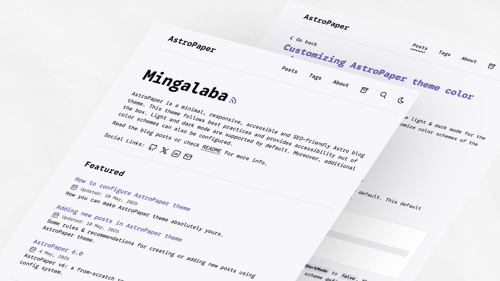
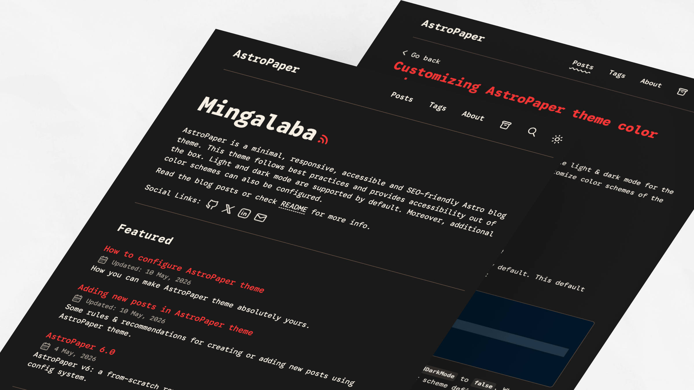

import ResponsiveTable from '@/components/ResponsiveTable.astro';

AstroPaper+ поставляется с набором готовых цветовых схем (унаследованных из upstream AstroPaper+), которые можно применить для настройки внешнего вида темы. Каждая схема задаёт полный набор пользовательских CSS-свойств (переменных) для светлого и тёмного режимов.

## Table of contents

## Быстрый старт

Чтобы применить готовую цветовую схему, скопируйте определения CSS-переменных в вашу конфигурацию темы. Подробные инструкции по настройке смотрите в руководстве по конфигурации цветовых схем.

## Справочник по CSS-переменным

Все цветовые схемы используют следующие пользовательские CSS-свойства:

<ResponsiveTable variant="striped-minimal">
| Переменная            | Назначение                                                  |
| --------------------- | ----------------------------------------------------------- |
| `--background`        | Основной фоновый цвет                                       |
| `--foreground`        | Основной цвет текста                                        |
| `--accent`            | Акцент / интерактивные элементы (ссылки, кнопки, подсветка) |
| `--accent-foreground` | Цвет текста на акцентных фонах                              |
| `--muted`             | Вторичный фоновый цвет для ненавязчивых секций              |
| `--muted-foreground`  | Цвет текста вторичного контента                             |
| `--border`            | Цвет границ и разделителей                                  |
</ResponsiveTable>

## Светлые схемы

Светлые цветовые схемы определены с помощью CSS-селекторов `:root` и `[data-theme="light"]`.

### Paper Light

Светлая тема AstroPaper+ по умолчанию.


```css
:root,
[data-theme="light"] {
  --background: #fdfdfd;
  --foreground: #282728;
  --accent: #006cac;
  --accent-foreground: #ffffff;
  --muted: #e6e6e6;
  --muted-foreground: #6b7280;
  --border: #ece9e9;
}

```

### Kha-Yan

Светлая схема с акцентом на фиолетовом и тёплым фоном.


```css
:root,
[data-theme="light"] {
  --background: #fefaec;
  --foreground: #120e01;
  --accent: #6e10cf;
  --accent-foreground: #fefaec;
  --muted: #dcdcdc;
  --muted-foreground: #6b7280;
  --border: #cdc4d6;
}

```

### Nila

Светлая схема в фиолетовых тонах с холодными голубыми подтонами.



```css
:root,
[data-theme="light"] {
  --background: #f6f6fb;
  --foreground: #0c0c19;
  --accent: #6760b4;
  --accent-foreground: #f3f3f3;
  --muted: #dddcea;
  --muted-foreground: #54515b;
  --border: #d8d6ec;
}

```

### Jadeite

Светлая схема с бирюзовым акцентом и нейтральным фоном.


```css
:root,
[data-theme="light"] {
  --background: #f6fcf7;
  --foreground: #060b07;
  --accent: #027c6d;
  --accent-foreground: #ffffff;
  --muted: #c9e4e2;
  --muted-foreground: #6b7280;
  --border: #d4e1df;
}

```

### Pyit Tine Htaung

Схема с красным и золотым акцентами в тёплых тонах.


```css
:root,
[data-theme="light"] {
  --background: #fffaf6;
  --foreground: #060503;
  --accent: #aa0215;
  --accent-foreground: #ffcf75;
  --muted: #ffdc98;
  --muted-foreground: #54515b;
  --border: #ffdc98;
}

```

## Тёмные схемы

Тёмные цветовые схемы определены с помощью CSS-селектора `[data-theme="dark"]`.

### Paper Dark

Оригинальная тёмная тема AstroPaper+ с голубыми акцентами.


```css
[data-theme="dark"] {
  --background: #2f3741;
  --foreground: #e6e6e6;
  --accent: #1ad9d9;
  --accent-foreground: #0d2b2b;
  --muted: #596b81;
  --muted-foreground: #8faabb;
  --border: #3b4655;
}

```

### Paper Dark II

Текущая тёмная тема по умолчанию с оранжевыми акцентами.


```css
[data-theme="dark"] {
  --background: #212737;
  --foreground: #eaedf3;
  --accent: #ff6b01;
  --accent-foreground: #ffffff;
  --muted: #343f60;
  --muted-foreground: #afb9ca;
  --border: #ab4b08;
}

```

### Deep Purple

Яркая тёмная схема с насыщенным пурпурным акцентом.


```css
[data-theme="dark"] {
  --background: #212737;
  --foreground: #eaedf3;
  --accent: #eb3fd3;
  --accent-foreground: #1a0d1a;
  --muted: #513f51;
  --muted-foreground: #c09abc;
  --border: #642451;
}

```

### Ember

Тёплая приглушённая тёмная схема с красными акцентами.



```css
[data-theme="dark"] {
  --background: #1a1a1a;
  --foreground: #f5efe4;
  --accent: #ff3737;
  --accent-foreground: #1a1a1a;
  --muted: #38342f;
  --muted-foreground: #a59a8c;
  --border: #6f5648;
}

```

### Espresso

Тёмная схема с акцентом на коричневых тёплых тонах.


```css
[data-theme="dark"] {
  --background: #2f2f2f;
  --foreground: #ebe5e1;
  --accent: #ee781e;
  --accent-foreground: #1a1a1a;
  --muted: #4f4b44;
  --muted-foreground: #ddbfa7;
  --border: #6f5648;
}

```


---

> **Originally written by [Sat Naing](https://github.com/satnaing) on
> [satnaing.dev](https://satnaing.dev/). Translated and adapted for the
> AstroPaper+ fork by [Mekan Soltanov](https://github.com/msoltanov).**
