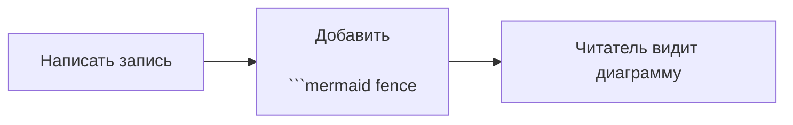
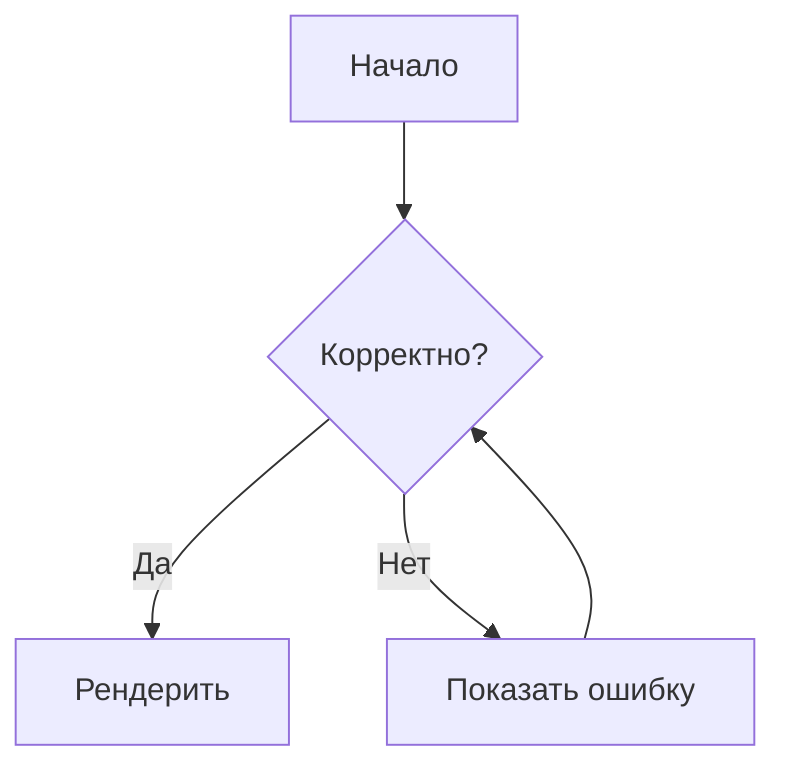
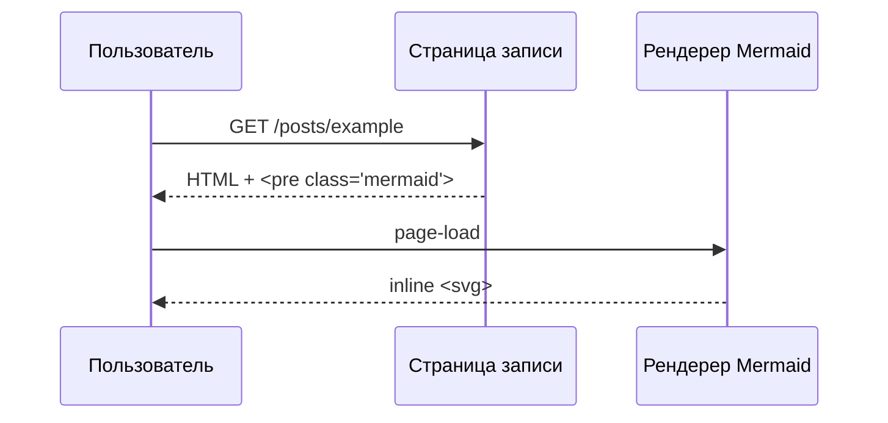
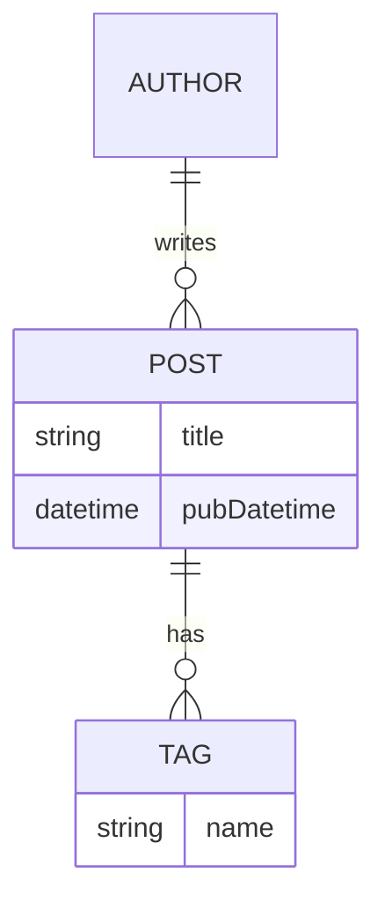
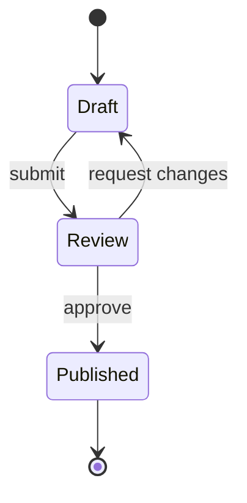
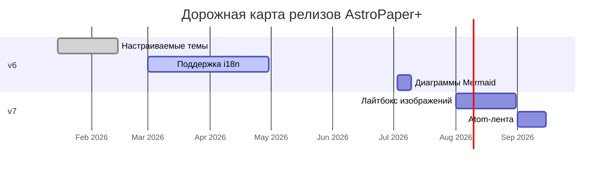
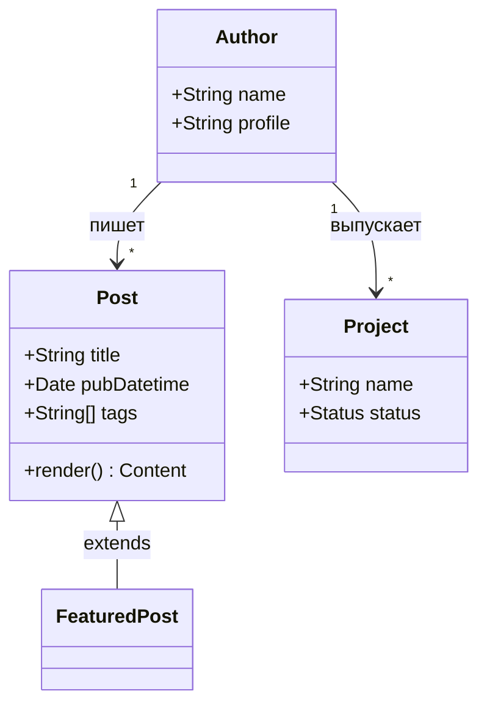
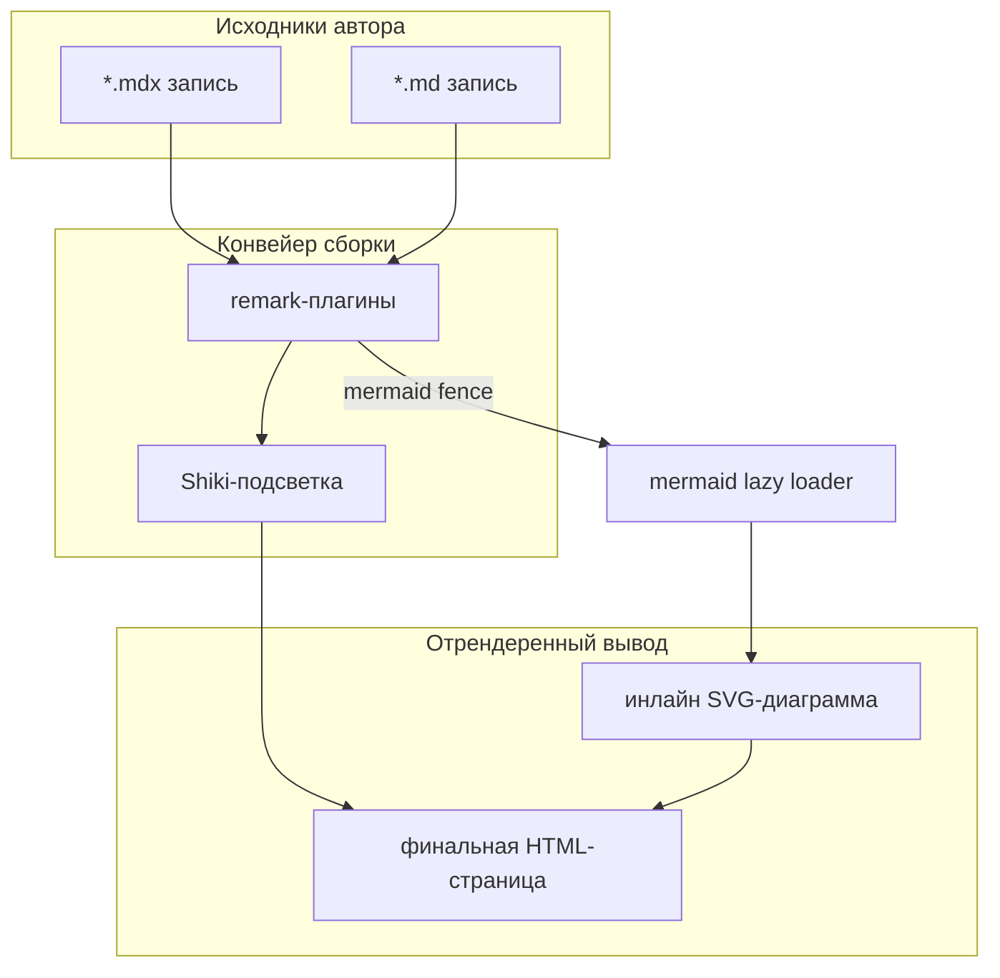
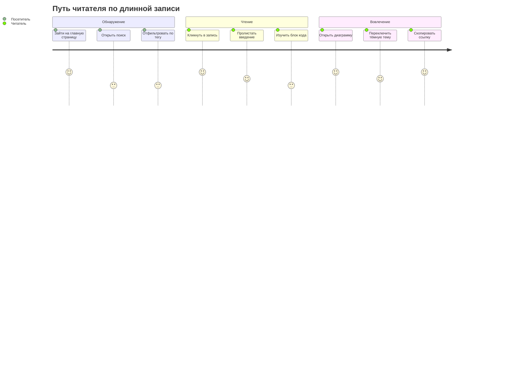

Этот пост показывает, как рендерить диаграммы [Mermaid](https://mermaid.js.org/) внутри записей AstroPaper+ — как в `.md`, так и в `.mdx`. Mermaid — это JavaScript-инструмент для построения диаграмм, который превращает текст в SVG: блок-схемы, диаграммы последовательностей, ER-диаграммы, диаграммы Ганта и т.д.

## Table of contents

## Быстрый пример

Диаграмма — это просто огороженный блок кода с языком `mermaid`:

````markdown


````

Что рендерится как:


## Почему именно такой подход

Большинство «рецептов Mermaid в Astro» опираются либо на SSR-рендеринг через headless-браузер (хрупкий в CI/Docker), либо на оборачивание диаграмм в React-компонент, который нужно импортировать везде. Эта настройка не идёт ни по одному из путей:

- **remark-плагин** (`src/utils/remarkMermaid.ts`) обнаруживает огороженные блоки `mermaid` и заменяет их плейсхолдером `<pre class="mermaid">…</pre>` до того, как остальной конвейер Markdown увидит их (так что Shiki не пытается подсветить исходник).
- **Клиентский рендерер** (`src/scripts/mermaid.ts`) заменяет каждый плейсхолдер инлайн-`<svg>` при загрузке страницы, тематизируя его через те же CSS-переменные `--color-*`, которые использует остальная тема.
- Рендерер **загружается по требованию** — бандл (~700 КБ минифицированный) подгружается только тогда, когда на текущей странице действительно есть диаграмма. Это одинаково хорошо работает для `.md` и `.mdx`, потому что список плагинов общий для `markdown.processor` и интеграции `@astrojs/mdx` (см. `src/remark-plugins.ts`).

## Включение в вашем форке

Подключение уже сделано в этом репозитории, но если вы скопировали AstroPaper+ (или upstream AstroPaper+) до этого изменения, шаги такие:

1. **Установите Mermaid**:

```bash
pnpm add mermaid

```

2. **Добавьте remark-плагин** по пути `src/utils/remarkMermaid.ts`:

```ts
import { visit, SKIP } from "unist-util-visit";

import type { Plugin } from "unified";
import type { Root, Code } from "mdast";

const remarkMermaid: Plugin<[], Root> = () => (tree) => {
  visit(tree, "code", (node: Code, index, parent) => {
    if (!parent || typeof index !== "number") return;
    if ((node.lang ?? "").toLowerCase() !== "mermaid") return;

    const src = node.value ?? "";
    const escaped = src
      .replace(/&/g, "&amp;")
      .replace(/</g, "&lt;")
      .replace(/>/g, "&gt;");

    (parent as { children: unknown[] }).children[index] = {
      type: "html",
      value: `<pre class="mermaid">${escaped}</pre>\n`,
    };

    return [SKIP, index + 1];
  });
};

export default remarkMermaid;

```

3. **Поделитесь списком плагинов между Markdown и MDX** в `src/remark-plugins.ts`:

```ts
import type { PluggableList } from "unified";

import remarkToc from "remark-toc";
import remarkCollapse from "remark-collapse";

import rehypeCallouts from "rehype-callouts";
import remarkMermaid from "@/utils/remarkMermaid";

export const remarkPlugins: PluggableList = [
  remarkMermaid,
  remarkToc,
  [remarkCollapse, { test: "Table of contents" }],
];

export const rehypePlugins: PluggableList = [rehypeCallouts];

```

4. **Подключите его в обоих конвейерах** в `astro.config.ts`:

```ts
import { remarkPlugins, rehypePlugins } from "./src/remark-plugins";

export default defineConfig({
  integrations: [mdx({ remarkPlugins, rehypePlugins }), sitemap()],
  markdown: {
    processor: unified({ remarkPlugins, rehypePlugins /* as any */ }),
    // ...
  },
});

```

---

## Примеры диаграмм

Вот полный набор типов диаграмм, которые поддерживаются «из коробки».

### Блок-схема



### Диаграмма последовательности



### ER-диаграмма



### Диаграмма состояний



---

## Другие примеры

Несколько других фигур, которые часто встречаются:

### Диаграмма Ганта

Удобно для дорожных карт релизов — поддерживает выполненные/активные майлстоуны и параллельные секции:



### Диаграмма классов

Полезно при документировании ООП-связей. Работают и множественность, и наследование:



### Git-граф

Для визуализации стратегий ветвления, релиз-тренов или истории форка:


### Архитектура с подграфами

Подграфы позволяют группировать связанные узлы, чтобы системная диаграмма оставалась читаемой:



### Путь пользователя

Используйте это, когда описываете путь читателя/пользователя по функции:



### Полный пример

Вот всё вместе — проза, списки, изображение и диаграмма — то, как обычно выглядит запись:

> **Резюме** — конвейер сборки превращает

````

```mermaid

```` fence в плейсхолдеры `<pre class="mermaid">` на стороне сервера. При загрузке страницы рендерер заменяет каждый плейсхолдер инлайн-`<svg>`. Никакого headless-браузера, никакого дополнительного шага сборки.

- Диаграммы **лениво загружаются**: бандл Mermaid отправляется только на страницы, где есть хотя бы одна диаграмма.
- Переключение темы перерисовывает существующие диаграммы без полной перезагрузки.
- Ошибки показываются красной блок-выноской, чтобы автор сразу их заметил.

```mermaid
flowchart LR
  Raw["mermaid исходник"] --> Build[конвейер сборки]
  Build --> Pre["&lt;pre class=mermaid&gt;"]
  Pre --> Viewer["на page-load"]
  Viewer --> SVG["инлайн &lt;svg&gt;"]

```

---

## Замечания

- **Ошибки видны читателю.** Если в исходнике синтаксическая ошибка, рендерер заменит `<pre>` небольшим красным блоком с сообщением об ошибке и исходным кодом, чтобы легко было поправить.
- **С учётом темы.** Рендерер перечитывает CSS-переменные `--color-*` при переключении `<html data-theme>`, так что переключатель светлой/тёмной темы перерисовывает существующие диаграммы, не дожидаясь перезагрузки. Он также перезапускается после view transitions Astro (`<ClientRouter />`).
- **Без headless-браузера.** Весь конвейер работает во время сборки (remark) + на клиенте (mermaid.js). Никакого Chromium, Puppeteer или Docker-приключений.
- **SEO-безопасный.** Сырой исходник остаётся в HTML в виде текста внутри `<pre class="mermaid">`, пока Mermaid его не заменит, так что поисковые роботы и RSS-читалки всё равно видят что-то осмысленное — а `data-pagefind-body` на статье по-прежнему индексирует запись.
- **`securityLevel: "strict"`** стоит по умолчанию — он блокирует инъекцию кликабельных ссылок в SVG. Если вам нужны ссылки внутри диаграмм, переключитесь на `"antiscript"` или `"loose"` и проверяйте исходники, которые принимаете.
